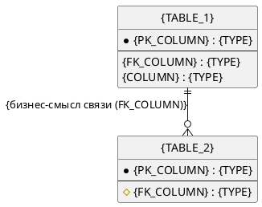

# Шаблон: Описание модели данных (ERD)

> **Назначение шаблона.** Документ типа **ERD** — это описание структуры одного домена/схемы базы данных: ER-диаграмма, каталог таблиц, связей и ограничений. Источник истины — DDL/миграции/ORM-маппинги репозитория; документ о таблице, которой нет в DDL, недопустим. Гранулярность: одна схема/бизнес-домен = один документ. Структура ниже обязательна; разделы не удалять.

**БД/инстанс**: `{DB_NAME}` (каноническое имя из конфигурации проекта)
**СУБД**: `{PostgreSQL | MySQL | …}`
**Схема/домен**: `{SCHEMA или бизнес-домен; «полная БД» при полном покрытии}`
**Источник DDL**: `{миграции/файлы схемы, относительные пути}`

---

## 1. Общее описание

`{Какая это БД и её назначение в бизнесе. Границы покрытия: какие таблицы входят в этот документ; что осознанно вне и почему (другой домен, legacy, вне схемы).}`

## 2. ER-диаграмма

> Формат строго **PlantUML** entity-нотация. У каждой сущности — PK и FK; у каждой связи — кардинальность и бизнес-подпись. Скрытые/технические поля (`created_at`, `updated_at`) допустимо опускать только в диаграмме — в каталоге (раздел 3) они обязательны.

## 3. Каталог таблиц

> Один подраздел `###` на каждую таблицу диаграммы. Колонки и ограничения — строго по DDL.

### `{TABLE_1}`

`{Назначение таблицы в бизнес-терминах}`

| Колонка | Тип | Null | Default | Ограничение (PK/FK/UNIQUE/CHECK) | Описание |
|---|---|---|---|---|---|
| `{COLUMN}` | `{TYPE}` | `{YES/NO}` | `{—/значение}` | `{PK}` | `{бизнес-смысл}` |
| `{FK_COLUMN}` | `{TYPE}` | `{YES/NO}` | `{—}` | `{FK → TABLE.PK}` | `{бизнес-смысл}` |

**Индексы:** `{имя индекса}` — `{на каких колонках}` — `{назначение: уникальность/поиск/связь}`

### `{TABLE_2}`

`{…}`

## 4. Каталог связей

| Родитель.колонка → Потомок.колонка | Кардинальность | Бизнес-смысл | ON DELETE |
|---|---|---|---|
| `{TABLE_1.PK}` → `{TABLE_2.FK}` | `{1 : N}` | `{почему существует зависимость}` | `{CASCADE / RESTRICT / SET NULL / —}` |

## 5. Ограничения и инварианты

> Только подтверждённое DDL/кодом: CHECK-условия и допустимые enum-значения, триггеры, генерация ключей (sequence/uuid), уникальные составные ограничения.

- `{CONSTRAINT/инвариант}` — `{суть ограничения}`

## 6. Полнота покрытия (Coverage Gate)

> Контрольная сверка. Расхождение любой строки — критическая ошибка (🔴).

| Источник | Кол-во таблиц | Комментарий |
|---|---|---|
| DDL/миграции (`{путь}`) | `{N}` | эталон |
| Сущности на диаграмме (раздел 2) | `{N}` | `{совпадает/расхождение}` |
| Подразделы каталога (раздел 3) | `{N}` | `{совпадает/расхождение}` |

`{Перечень таблиц схемы, осознанно не включённых в документ, с обоснованием; либо «покрытие полное»}`

## 7. Якоря истины (Technical Evidence)

*Этот раздел заполняется агентом для самопроверки и не является частью бизнес-документации. Пути строго ОТНОСИТЕЛЬНЫЕ от корня проекта.*

- **Source of DDL:** `{относительные пути к миграциям/схеме}`
- **Source of Mapping:** `{ORM-маппинги/Repository, подтверждающие использование таблиц}`
- **Validation Status:** Проверено: каждая таблица существует в DDL, колонки совпадают с DDL, Coverage Gate пройден.
