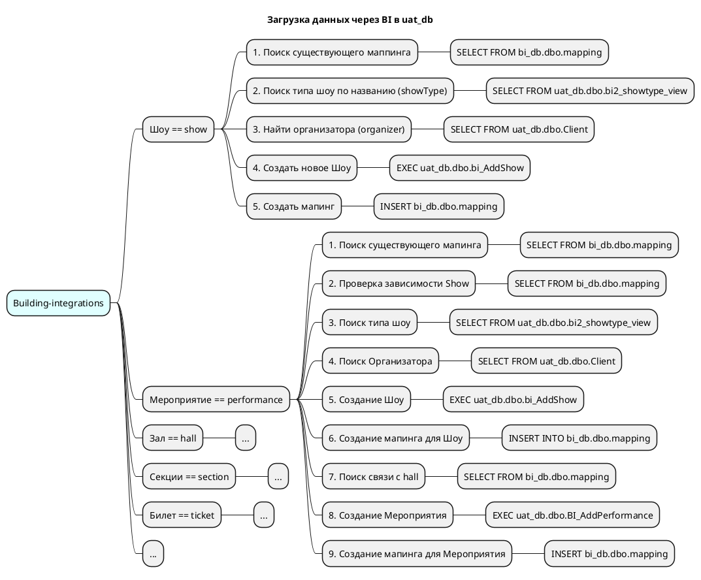

# Mindmap: Building-integrations — типы объектов (обзор)

> Карта погружения «от общего к частному». Обзорный документ: детали — в api/, integrations/, erd/, data_trace/. Задача: ad hoc.

**Сервис**: building-integrations · **Ось**: типы объектов · **Режим**: As-Is · **Цветовое измерение**: нет (одно хранилище-цель, цвет не кодируется)

**Источники фактов**: эталон скилла — рабочая карта владельца (BI → uat_db). При генерации здесь перечисляются использованные документы со статусами ✅/🟡 и дата repomix-снапшота.

## Пруфы и источники

- Ось L1 — пары «бизнес-имя == тех.идентификатор» (`Шоу == show`); единицы без покрытия — честные заглушки `...` (принцип 7), НЕ молчаливый пропуск.
- Шаги L2 нумерованы в порядке выполнения; листья L3 — SQL-атомы с полным квалификатором (`EXEC uat_db.dbo.bi_AddShow`).
- Цвет не используется → legend отсутствует (правило: legend обязательна только при использовании цвета).
- При генерации здесь — относительные ссылки на использованные документы (`../erd/erd_*.md`, `../naming_conventions.md`).
