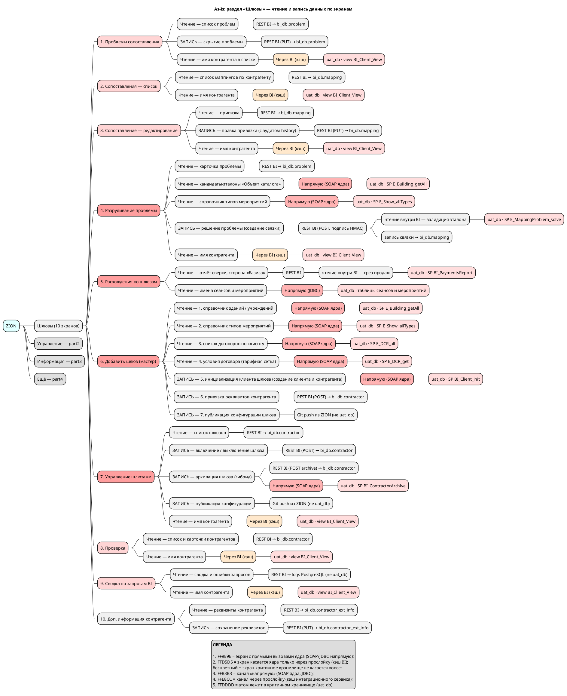

# Mindmap: ZION — UI-экраны, раздел «Шлюзы» (обзор)

> Карта погружения «от общего к частному». Обзорный документ: детали — в screens/, api/, integrations/, data_trace/. Задача: [T9].

**Сервис**: zion · **Ось**: UI-экраны (раздел «Шлюзы») · **Режим**: As-Is · **Цветовое измерение**: риск касания uat_db

**Источники фактов**: эталон скилла — рабочая карта владельца (ZION, As-Is). При генерации здесь перечисляются использованные документы со статусами ✅/🟡 и дата repomix-снапшота; 🟡-документы — с пометкой «не валидировано».

## Пруфы и источники

- Раздел L1 «Шлюзы (10 экранов)» — счётчик совпадает с числом элементов L2 (1–10); остальные разделы вынесены в part2–part4 (заглушки).
- Атомы `uat_db · SP …` / `uat_db · view …` подтверждены SQL/SOAP-вызовами в коде; при генерации здесь — относительные ссылки на использованные документы (`../screens/screen_*.md`, `../api_map.md`).
- Цвет: одно измерение (риск касания uat_db), legend взаимно полна (см. `resources/mindmap_colors.md`).
