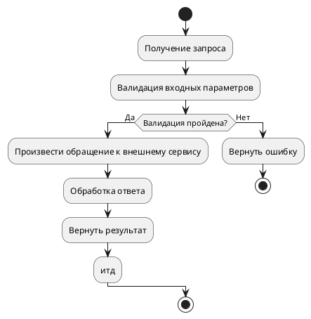
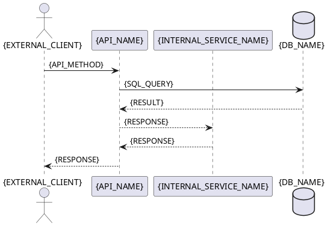

# Шаблон: Документирование интеграционного API взаимодействия

**Описание**: `{Описание метода}`
**Назначение**: `{Для чего нужен этот API}`
**URL-path**: `{URL_INTEGRATION_API}`
**Параметры**: `{Что принимает метода}`
**Ответ**: `{Что возвращает метод}`

---

## 1. Описание API метода `{METHOD TYPE: GET/POST/PUT/DELETE} {URL_INTEGRATION_API}`

### Входные параметры

**Параметры**:

> **Колонка «Обязательность»** (применяется ко всем таблицам ниже):
>
> - **Да** — поле всегда присутствует с непустым значением;
> - **Да (nullable)** — ключ присутствует всегда, но значение может быть `null`;
> - **Условно** — ключ присутствует только при выполнении условия (иначе отсутствует).

| Параметр / Header | Тип | Обязательность | Описание | Пример | Комментарий | Мапинг (БД/Метод/Сервис/API) |
|-------------------|-----|----------------|----------|--------|-------------|-----------------------------|
| `{HEADER_NAME}` | `{HEADER_TYPE}` | `{required/optional}` |`{HEADER_DESCRIPTION}` | `{HEADER_EXAMPLE}` | `{HEADER_COMMENT}` | `{HEADER_MAPPING}` |
| `{PARAM_NAME}` | `{PARAM_TYPE}` | `{required/optional}` | `{PARAM_DESCRIPTION}` | `{Внешнаяя интеграция/Атрибут вычисляется/Итд}` | `{PARAM_EXAMPLE}` | `{API_method + param_name} или {TABLE_NAME.FIELD_NAME} или {METHOD_NAME}` |

### Алгоритм метода



### Sequence-Диаграмма



### Выходные параметры (ответ)
>
> **Колонка «Обязательность»** (применяется ко всем таблицам ниже):
>
> - **Да** — поле всегда присутствует с непустым значением;
> - **Да (nullable)** — ключ присутствует всегда, но значение может быть `null`;
> - **Условно** — ключ присутствует только при выполнении условия (иначе отсутствует).

| Параметр / Header | Тип | Обязательность | Описание | Пример | Комментарий |Мапинг (БД/Метод/Сервис/API) |
|-------------------|-----|----------------|----------|--------|-------------|-----------------------------|
| `{HEADER_NAME}` | `{HEADER_TYPE}` | `{required/optional}` |`{HEADER_DESCRIPTION}` | `{HEADER_EXAMPLE}` | `{HEADER_COMMENT}` | `{HEADER_MAPPING}` |
| `{PARAM_NAME}` | `{PARAM_TYPE}` | `{required/optional}` | `{PARAM_DESCRIPTION}` | `{Внешнаяя интеграция/Атрибут вычисляется/Итд}` | `{PARAM_EXAMPLE}` | `{API_method + param_name} или {TABLE_NAME.FIELD_NAME} или {METHOD_NAME}` |
| `{NESTED_OBJECT_NAME}` | `Object<{ObjectName}>` / `Array<{ObjectName}>` | `{required/optional}` | `{OBJECT_DESCRIPTION}` | `{...}` / `[{...}]` | См. подтаблицу ниже | `—` |

> **Типизация контейнеров (обязательно):** тип любого поля-контейнера обязан указывать имя элемента/объекта. Одиночный объект — `Object<{ObjectName}>`; массив объектов — `Array<{ObjectName}>`; массив скаляров — `Array<{scalar}>` (`Array<string>`, `Array<int>`). Здесь `{ObjectName}` = имя DTO/класса из кода либо описательное имя объекта. Голый `Object`, `array`, `list` без параметра **запрещены** — теряется имя DTO и связь с подтаблицей. Для `Object<{ObjectName}>` и `Array<{ObjectName}>` имя `{ObjectName}` обязано совпадать с заголовком парной подтаблицы «Описание вложенного {ObjectName}». Вырожденные параметры (`Object<>`, `Array<>`, `Array<mixed>`) недопустимы.

> **Вложенные объекты:** если поле ответа имеет тип `Object<{ObjectName}>` или `Array<{ObjectName}>`, оно указывается в основной таблице как контейнер (Origin = `—`), а его внутренние поля раскрываются ниже в отдельной подтаблице `#### Описание вложенного {ObjectName}`. Это сохраняет иерархию и читаемость Origin-маппинга. Для простых ответов (без вложенных объектов) подтаблицы не создаются.

#### Описание вложенного `{ObjectName}`

| Параметр | Тип | Обязательность | Описание | Пример | Origin (Происхождение) |
|----------|-----|----------------|----------|--------|------------------------|
| `{PARAM_NAME}` | `{PARAM_TYPE}` | `{required/optional}` | `{PARAM_DESCRIPTION}` | `{PARAM_EXAMPLE}` | `{TABLE_NAME.FIELD_NAME}` / `{API_NAME.JSON_PATH}` / `{METHOD_NAME}` |
| `{NESTED_OBJECT_NAME_2}` | `Object<{ObjectName_2}>` | `{required/optional}` | `{OBJECT_DESCRIPTION}` | `{...}` | См. подтаблицу `Описание вложенного {ObjectName_2}` |

> **Рекурсивность:** если вложенный объект сам содержит вложенные объекты — для каждого создаётся собственная подтаблица `#### Описание вложенного {ObjectName_N}` по тому же формату.

---

## Запросы к внешнему сервису/к БД/и тд

### Поисковый запрос к БД

```sql
{BASIS_SEARCH_SQL}
```

**Параметры**:

| Параметр | Тип | Описание | Пример |
|----------|------|-------------|---------|
| `{BASIS_SEARCH_PARAMS}` |

**Возвращает**:

| Параметр | Тип | Описание | Пример |
|----------|------|-------------|---------|
| `{BASIS_SEARCH_PARAMS}` |

### Вызов внешнего сервиса {SERVICE_NAME} по API {API_TYPE: GET/POST/PUT/DELETE} {API_NAME}

#### Входные параметры

**Параметры**:

| Параметр | Тип | Описание | Пример |
|----------|-----|-----------|--------|
| `{PARAM_NAME}` | `{PARAM_TYPE}` | `{PARAM_DESCRIPTION}` | `{PARAM_EXAMPLE}` |

#### Выходные параметры

**Параметры**:

| Параметр | Тип | Описание | Пример | Origin (Происхождение) |
|----------|-----|-----------|--------|---------|
| `{PARAM_NAME}` | `{PARAM_TYPE}` | `{PARAM_DESCRIPTION}` | `{PARAM_EXAMPLE}` | `{TABLE_NAME.FIELD_NAME}` / `{API_NAME.JSON_PATH}` / `{METHOD_NAME}` |
| `{NESTED_OBJECT_NAME}` | `Object<{ObjectName}>` / `Array<{ObjectName}>` | `{OBJECT_DESCRIPTION}` | `{...}` / `[{...}]` | `—` |

> **Типизация контейнеров (обязательно):** тип поля-контейнера обязан указывать имя элемента/объекта — `Object<{ObjectName}>` (одиночный объект), `Array<{ObjectName}>` (массив объектов), `Array<{scalar}>` (массив скаляров). Голый `Object`, `array`, `list` без параметра **запрещены**. Вырожденные параметры (`Object<>`, `Array<>`, `Array<mixed>`) недопустимы.

> **Вложенные объекты:** если ответ внешнего сервиса содержит поле типа `Object<{ObjectName}>` или `Array<{ObjectName}>`, оно указывается в таблице выше как контейнер (Origin = `—`), а его внутренние поля раскрываются ниже в подтаблице `##### Описание вложенного {ObjectName}`. Рекурсивно — для каждого вложенного объекта своя подтаблица. Для простых ответов подтаблицы не создаются.

##### Описание вложенного `{ObjectName}`

| Параметр | Тип | Описание | Пример | Origin (Происхождение) |
|----------|-----|-----------|--------|---------|
| `{PARAM_NAME}` | `{PARAM_TYPE}` | `{PARAM_DESCRIPTION}` | `{PARAM_EXAMPLE}` | `{TABLE_NAME.FIELD_NAME}` / `{API_NAME.JSON_PATH}` / `{METHOD_NAME}` |

## Технические Пруфы (Technical Evidence)

 *Этот раздел заполняется агентом для самопроверки и не является частью бизнес-документации.*

- - **Source of URL:** [Ссылка на файл конфигурации] + [Ссылка на интерфейс/контроллер]
- - **Source of Data:** [Ссылка на файл DTO/Модели]
- - **Validation Status:** Проверено на соответствие полному списку полей (Entity Coverage Check).
