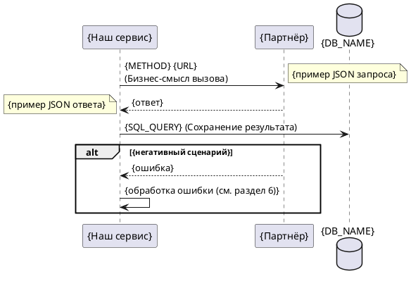
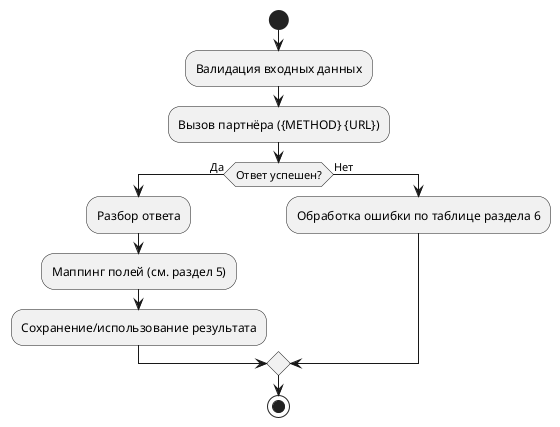

# Шаблон: Документирование интеграционного взаимодействия

> **Назначение шаблона.** Документ типа **Integration** («Интеграция») — это полное описание ОДНОГО взаимодействия анализируемого сервиса с одним внешним партнёром (исходящего или входящего): контракт данных, конфигурация, маппинг полей и обработка ошибок. Владелец документа — сервис-инициатор (клиент), чей код анализируется; сохраняется в папку `integrations/` папки сервиса. Структура ниже обязательна; разделы не удалять.

**Описание**: `{Что это за интеграция, одной фразой}`
**Направление**: `{Исходящая (мы вызываем партнёра) | Входящая (партнёр вызывает нас)}`
**Партнёр**: `{Имя внешней системы/сервиса}`
**Протокол**: `{REST | SOAP | gRPC | AMQP | Webhook | …}`
**Эндпоинт**: `{METHOD} {URL}` (для входящей — наш эндпоинт, для исходящей — эндпоинт партнёра)

---

## 1. Общее описание интеграции

`{Бизнес-цель: зачем сервису это взаимодействие. Кто инициатор обмена. Синхронность: sync-вызов / асинхронная очередь / webhook. Триггер и частота: по действию пользователя, по расписанию (cron), по событию.}`

## 2. Топология и конфигурация

> Все значения — только подтверждённые кодом/конфигом. Не выдумывай адреса и ключи.

| Конфиг-ключ | Значение | Файл конфигурации (относительный путь) |
|---|---|---|
| `{BASE_URL / HOST / QUEUE_NAME}` | `{значение}` | `{path/to/config}` |
| `{TIMEOUT / RETRY}` | `{значение}` | `{path/to/config}` |

**Аутентификация**: `{тип: токен/подпись/basic/mTLS; откуда берётся ключ — конфиг-ключ или сервис}`

**Окружения**: `{dev/prod значения, если различаются и подтверждены конфигом; иначе «—»}`

## 3. Входные параметры (запрос)

> **Колонка «Обязательность»** (применяется ко всем таблицам ниже):
>
> - **Да** — поле всегда присутствует с непустым значением;
> - **Да (nullable)** — ключ присутствует всегда, но значение может быть `null`;
> - **Условно** — ключ присутствует только при выполнении условия (иначе отсутствует).

| Параметр / Header | Тип | Обязательность | Описание | Пример | Комментарий | Мапинг (БД/Метод/Сервис/API) |
|-------------------|-----|----------------|----------|--------|-------------|------------------------------|
| `{PARAM_NAME}` | `{PARAM_TYPE}` | `{required/optional}` | `{PARAM_DESCRIPTION}` | `{PARAM_EXAMPLE}` | `{PARAM_COMMENT}` | `{TABLE_NAME.FIELD_NAME} или {METHOD_NAME}` |

## 4. Выходные параметры (ответ партнёра)

| Параметр | Тип | Обязательность | Описание | Пример | Комментарий |
|----------|-----|----------------|----------|--------|-------------|
| `{PARAM_NAME}` | `{PARAM_TYPE}` | `{required/optional}` | `{PARAM_DESCRIPTION}` | `{PARAM_EXAMPLE}` | `{PARAM_COMMENT}` |
| `{NESTED_OBJECT_NAME}` | `Object<{ObjectName}>` / `Array<{ObjectName}>` | `{required/optional}` | `{OBJECT_DESCRIPTION}` | `{...}` / `[{...}]` | См. подтаблицу ниже |

> **Типизация контейнеров (обязательно):** тип любого поля-контейнера обязан указывать имя элемента/объекта. Одиночный объект — `Object<{ObjectName}>`; массив объектов — `Array<{ObjectName}>`; массив скаляров — `Array<{scalar}>`. Голый `Object`, `array`, `list` без параметра **запрещены**. Для `Object<{ObjectName}>` и `Array<{ObjectName}>` имя обязано совпадать с заголовком парной подтаблицы.

> **Вложенные объекты:** поле-контейнер указывается в основной таблице, а его поля раскрываются ниже в подтаблице `#### Описание вложенного {ObjectName}`. Рекурсивно — для каждого вложенного объекта своя подтаблица.

#### Описание вложенного `{ObjectName}`

| Параметр | Тип | Обязательность | Описание | Пример |
|----------|-----|----------------|----------|--------|
| `{PARAM_NAME}` | `{PARAM_TYPE}` | `{required/optional}` | `{PARAM_DESCRIPTION}` | `{PARAM_EXAMPLE}` |

## 5. Маппинг полей

> Принцип **No Silent Skip**: все поля ответа партнёра обязаны быть перечислены — используемые в таблице маппинга, неиспользуемые в таблице «Игнорируемые поля» ниже.

**Передаваемые поля:**

| Наше поле (код) | Наш Origin (TABLE.COLUMN) | Поле партнёра (JSON_PATH) | Трансформация |
|---|---|---|---|
| `{our_field}` | `{TABLE.COLUMN}` или `—` (если только пересылка) | `{partner.json.path}` | `{формат/enum-маппинг/вычисление; «напрямую» если без изменений}` |

**Игнорируемые поля ответа партнёра:**

| Поле партнёра (JSON_PATH) | Причина игнорирования |
|---|---|
| `{partner.json.path}` | `{не используется в бизнес-логике / нет потребителя}` |

## 6. Обработка ошибок

| Код/ситуация партнёра | Наше поведение | Комментарий |
|---|---|---|
| `{HTTP 4xx / код ошибки / timeout}` | `{код ответа клиенту / исключение / fallback-значение}` | `{комментарий}` |

**Устойчивость** (только подтверждённое кодом): таймауты — `{значение}`; ретраи — `{кол-во/политика}`; идемпотентность — `{ключ/механизм}`; компенсация — `{механизм при сбое}`.

## 7. Sequence-диаграмма

## 8. Алгоритм обработки (Activity)

## 9. Якоря истины (Technical Evidence)

*Этот раздел заполняется агентом для самопроверки и не является частью бизнес-документации.*

- **Source of URL:** `{конфиг-файл} + {клиентский класс/метод, выполняющий вызов}`
- **Source of Contract:** `{интерфейс/WSDL/proto-файл/DTO запроса и ответа}`
- **Source of Model:** `{DTO/сущности для маппинга}`
- **Validation Status:** Проверено: Full Entity Coverage ответа партнёра, No Silent Skip, физический эндпоинт из конфига.
