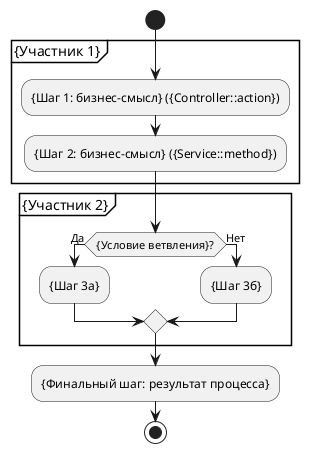
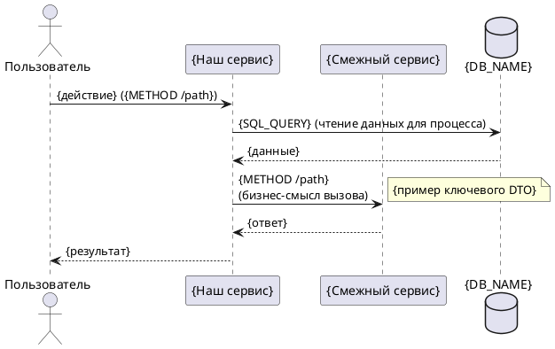

# Шаблон: Описание бизнес-процесса (Process)

> **Назначение шаблона.** Документ типа **Process** — это описание одного сквозного бизнес-процесса: участники, шаги, ветвления и альтернативные сценарии, восстановленные по коду (контроллеры, сервисы, очереди). Он не дублирует контракты эндпоинтов и интеграций — на них даются ссылки (reuse). Имя файла — по названию процесса, не по эндпоинту. Структура ниже обязательна; разделы не удалять.

**Название процесса**: `{Человекочитаемое название}`
**Триггер**: `{событие | METHOD /path | cron-расписание | действие пользователя}`
**Участники**: `{перечень систем/акторов}`
**Вход / Выход**: `{что получает процесс на входе} / {какой результат на выходе}`

---

## 1. Общее описание

`{Бизнес-цель процесса: зачем он существует, начало и конец, итоговый результат для бизнеса.}`

## 2. Участники и роли

| Актор / система | Роль в процессе | Точка входа |
|---|---|---|
| `{Наш сервис (Controller::action)}` | `{что делает}` | `{METHOD /path}` |
| `{Внешний сервис / очередь}` | `{что делает}` | `{URL / имя очереди}` |
| `{Пользователь}` | `{что делает}` | `{экран / UI-действие}` |

## 3. Activity-диаграмма (основной сценарий)

> Формат строго **PlantUML**. `partition` — по участникам; все ветвления — `if/else`; параллельные шаги — `fork`. Надписи на русском, техимена в скобках.

## 4. Sequence-диаграмма

> Межкомпонентное взаимодействие основного сценария. На стрелках — `METHOD /path` (или имя очереди/события) и русское описание. `note` — примеры ключевых DTO.

## 5. Пошаговое описание

> Шаги синхронны с Activity-диаграммой: количество и порядок совпадают. Каждый шаг привязан к коду или помечен `[NEEDS_INVESTIGATION]`.

| # | Кто | Что делает (бизнес-язык) | Техническая привязка | Результат шага |
|---|---|---|---|---|
| 1 | `{участник}` | `{бизнес-описание шага}` | `{Controller::action / METHOD /path / TABLE}` | `{что изменилось}` |
| 2 | `{участник}` | `{…}` | `{…}` | `{…}` |

## 6. Ветвления и альтернативные сценарии

| Условие | Путь процесса | Последствия |
|---|---|---|
| `{условие ветвления}` | `{какие шаги вместо основных}` | `{бизнес-последствия, ошибки, компенсации}` |
| `{ошибка/таймаут смежного сервиса}` | `{fallback-путь}` | `{…}` |

## 7. Ссылки на смежные документы

> Reuse: детали контрактов не дублируются — только ссылки (относительные пути от этого файла).

- API-методы процесса: `[api_….md](../api/api_….md)`
- Интеграции: `[integration_….md](../integrations/integration_….md)`
- Трассировки данных: `[data_trace_….md](../data_trace/data_trace_….md)`
- ERD задействованных схем: `[erd_….md](../erd/erd_….md)`

## 8. Якоря истины (Technical Evidence)

*Этот раздел заполняется агентом для самопроверки и не является частью бизнес-документации. Пути строго ОТНОСИТЕЛЬНЫЕ от корня проекта.*

- **Source of Flow:** `{файлы, подтверждающие последовательность шагов: контроллеры/сервисы/конфиги очередей}`
- **Source of Branching:** `{места ветвлений в коде}`
- **Validation Status:** Проверено: каждый шаг привязан к коду или помечен `[NEEDS_INVESTIGATION]`; число шагов текста = числу шагов Activity.
