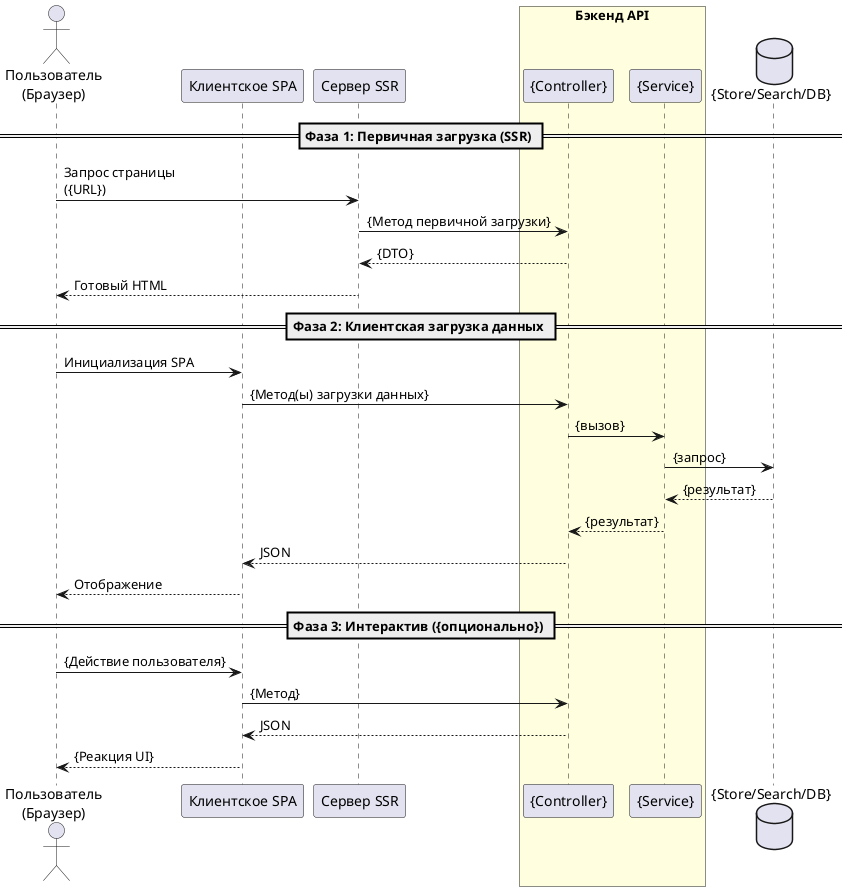

# Шаблон: Описание экрана (обзорный индекс)

> **Назначение шаблона.** Документ типа **Screen** («Описание экранов») — это обзорная карта одного экрана (страницы) приложения и точка входа в его документацию. Он НЕ дублирует детальное описание API-методов: каждый метод описывается в собственном документе типа API (папка `api/`), а здесь приводится только сводная карта методов со ссылками. Структура ниже обязательна; разделы не удалять.

---

# Экран «{Человекочитаемое название экрана}» — {ТехническоеИмя/Маршрут} (обзор)

> **Индекс экрана.** В соответствии с концепцией «один API-метод = один документ» детальное описание каждого метода вынесено в отдельные файлы (см. «Карту методов экрана»). Этот файл — обзорная карта экрана и точка входа.
> Задача: **{ID}** (зонтичная){, если есть подзадачи: + «. Подзадачи: {ID.x–ID.y}.»}

**Описание**: `{Что это за экран, какую бизнес-функцию выполняет}`
**Назначение**: `{Какие данные и для каких блоков/вкладок экрана нужны}`
**Маршрут(ы)**: `{Внешний URL(ы) экрана, напр. /search/performance, /afisha}`
**Фронтенд**: `{✅ Новый (ssr) / ⚠️ Special / Legacy — компонент(ы)}`

---

## Карта методов экрана

> Перечисли ВСЕ API-методы, вызываемые на экране. Собственные методы экрана — со ссылкой на их документ в `api/`. Переиспользуемые методы (reuse) вынеси в отдельную таблицу ниже с указанием владельца.

| # | Метод | Назначение | Контроллер | Документ |
|---|---|---|---|---|
| `{ID.1}` | `{METHOD} {URL}` | `{назначение}` | `{Controller::action}` | [{api_файл}.md]({api_файл}.md) |
| `{ID.2}` | `{METHOD} {URL}` | `{назначение}` | `{Controller::action}` | [{api_файл}.md]({api_файл}.md) |

**Переиспользуемые методы (reuse, документируются у владельца):**

| Метод | Назначение | Контроллер | Документ | Владелец |
|---|---|---|---|---|
| `{METHOD} {URL}` | `{назначение}` | `{Controller::action}` | [{api_файл}.md]({api_файл}.md) | `{ID владельца}` |

---

## {Доменная карта экрана — опциональный раздел}

> Опциональный раздел для специфики экрана: маппинг вкладок на источники данных, типы фильтров, привязка к поисковым индексам/таблицам и т.п. Удалить, если не применимо.

| `{Измерение}` | `{Источник/Индекс}` | `{Основной метод}` |
|---|---|---|
| `{...}` | `{...}` | `{...}` |

---

## Сквозной Sequence экрана

> Одна сводная Sequence-диаграмма всего экрана: фазы загрузки (SSR preFetch → клиентская загрузка → интерактив). Детальные диаграммы отдельных методов — в их документах. Формат строго **PlantUML**, надписи на стрелках — на русском.

> Детальные Sequence-диаграммы, таблицы параметров, маппинг полей и якоря истины — в документах конкретных методов (см. «Карту методов экрана» выше).

---

## Общие технические пруфы (Technical Evidence)

> Общие для всего экрана якоря истины: роутинг, контроллеры, фронтенд-точки входа. Поля конкретных методов и их Origin-маппинг — в документах методов. Пути строго ОТНОСИТЕЛЬНЫЕ от корня проекта.

* **Маршрутизация**: `{относительный/путь/к/файлу/роутинга}`.
* **Контроллеры**: `{Controller}` (`{относительный/путь}`), …
* **Фронтенд**: `{относительные/пути: api-сервис, router-модуль, store, _domain}`.
