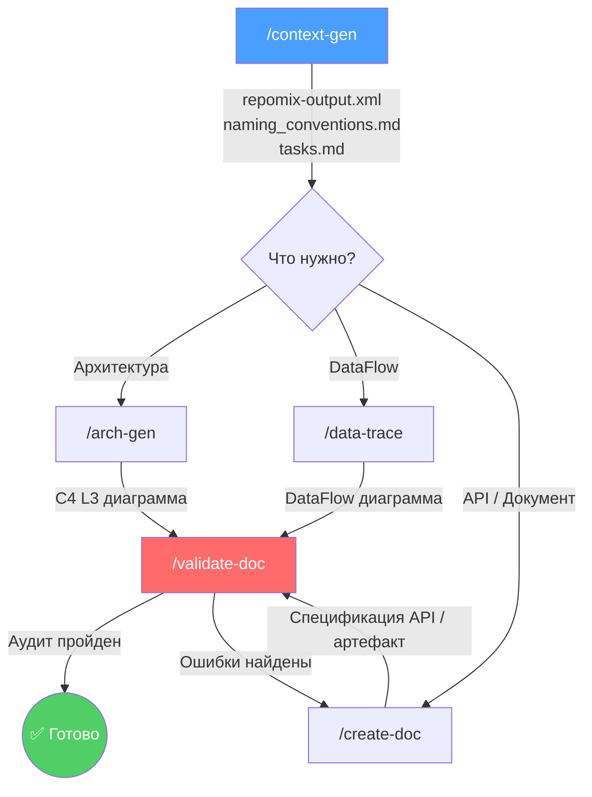
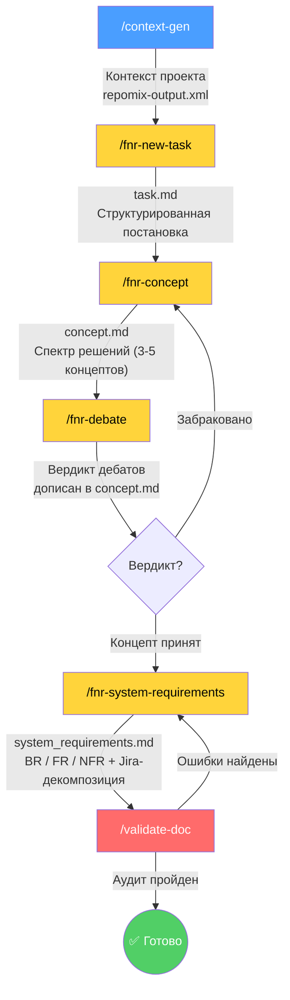

# 🚀 System Analyst Helper (SA-Helper)

**SA-Helper** — это промышленный фреймворк для ИИ-агентов, разработанный для автоматизации реверс-инжиниринга, создания технической документации и формирования системных требований к изменениям.

## 🎯 Назначение

Инструмент позволяет системному аналитику:

- **Реверс-инжиниринг:** превращать программный код в точные артефакты (C4, DataFlow, API-спецификации).
- **Системные требования:** проходить путь от свободного описания проблемы до формального документа требований с Jira-декомпозицией.

Основной упор сделан на исключение "галлюцинаций" и обеспечение полной прослеживаемости данных (Traceability).

---

## ⚡ Быстрый старт (Установка)

Чтобы развернуть помощника в новом проекте, выполните одну команду в терминале:

```bash
curl -sSL https://raw.githubusercontent.com/boboden541/sa-helper/main/install.sh -o /tmp/sa-install.sh && bash /tmp/sa-install.sh && rm /tmp/sa-install.sh
```

Скрипт спросит, какой IDE-агент вы используете, и автоматически создаст нужную структуру папок:

| | Claude Code | Antigravity | Codex | OpenCode | Universal |
|---|---|---|---|---|---|
| Корневая папка | `.claude/` | `.agent/` | `.agents/` | `.opencode/` | `.agents/` |
| Команды | `commands/` | `workflows/` | `prompts/` | `commands/` | не устанавливаются |
| Навыки | `skills/` | `skills/` | `.agents/skills/` | `.agents/skills/` | `.agents/skills/` |

Содержимое навыков и команд не удаляет чужие файлы: для Claude Code и Antigravity навыки обновляются в их локальных папках, а для Codex, OpenCode и универсального агента навыки публикуются в `.agents/skills/` в каноническом формате `SKILL.md` с `name` и `description`.

### 🔧 Продвинутая настройка (Aliases)

Чтобы не копировать длинную команду `curl` каждый раз, вы можете создать короткий псевдоним в вашей системе.

Добавьте следующую строку в ваш файл конфигурации оболочки (`~/.zshrc` или `~/.bashrc`):

#### Определи свой шелл

Введи в терминале `echo $SHELL`

- Если видишь `/bin/zsh` — твой файл ~/.zshrc
- Если видишь `/bin/bash` — твой файл ~/.bashrc

#### Запиши команду в конфиг

Выполни в терминале одну команду (заменив `~/.zshrc` на свой файл, если нужно):

```
echo "alias init_sa='curl -sSL https://raw.githubusercontent.com/boboden541/sa-helper/main/install.sh -o /tmp/sa-install.sh && bash /tmp/sa-install.sh && rm /tmp/sa-install.sh'" >> ~/.zshrc
```

#### Обновление алиаса (если у вас старая версия)

Если `init_sa` не спрашивает агент — у вас старый алиас. Обновите:

```
sed -i '' '/alias init_sa/d' ~/.zshrc
echo "alias init_sa='curl -sSL https://raw.githubusercontent.com/boboden541/sa-helper/main/install.sh -o /tmp/sa-install.sh && bash /tmp/sa-install.sh && rm /tmp/sa-install.sh'" >> ~/.zshrc
```

Для bash замените `sed -i ''` на `sed -i`:

```
sed -i '/alias init_sa/d' ~/.bashrc
echo "alias init_sa='curl -sSL https://raw.githubusercontent.com/boboden541/sa-helper/main/install.sh -o /tmp/sa-install.sh && bash /tmp/sa-install.sh && rm /tmp/sa-install.sh'" >> ~/.bashrc
```

#### Примени изменения

```
source ~/.zshrc
```

#### Проверь

Просто напиши `init_sa` в любой папке проекта

**Важно:** После завершения установки обязательно перезагрузите окно вашей IDE (Reload Window), чтобы команды стали доступны в чате.

# 🔄 Обновление

Для обновления хелпера до последней версии просто запустите команду установки повторно. Скрипт автоматически скачает актуальные файлы из репозитория и обновит только управляемые подпапки выбранного агента, не удаляя всю папку агента целиком. Для Codex skills и prompts будут синхронизированы в `.agents/` с корректным `SKILL.md` в skills.

```bash
curl -sSL https://raw.githubusercontent.com/boboden541/sa-helper/main/install.sh -o /tmp/sa-install.sh && bash /tmp/sa-install.sh && rm /tmp/sa-install.sh
```

---

# 📊 Процессы и диаграммы

## Процесс 1: Реверс-инжиниринг и документация

Путь от «сырого» кода к документированной системе.



## Процесс 2: Формирование системных требований (FNR Pipeline)

Путь от свободного описания проблемы до формального документа требований с Jira-декомпозицией.



---

# 🛠 Доступные команды

## Команды реверс-инжиниринга

| Команда | Описание | Результат |
|---|---|---|
| `/context-gen` | Подготовка контекста проекта | `repomix-output.xml`, `naming_conventions.md`, `tasks.md` |
| `/arch-gen` | Формирование архитектуры | C4 Level 3 диаграмма (PlantUML) |
| `/data-trace` | Формирование DataFlow диаграммы | DataFlow по сущности или атрибуту |
| `/create-doc` | Генерация документа | Спецификация API / метода / артефакта |
| `/validate-doc` | Тотальная проверка документа | Аудит на соответствие коду и стандартам |

## Команды системных требований (FNR Pipeline)

| Команда | Навык (роль) | Описание | Результат |
|---|---|---|---|
| `/fnr-new-task` | Problem Analyst | Постановка задачи: анализ проблемы, поиск корня в коде | `sa_documentation/FNR/FNR_N/task.md` |
| `/fnr-concept` | Solution Designer | Генерация спектра решений (от чистого до костыля) | `sa_documentation/FNR/FNR_N/concept.md` |
| `/fnr-debate` | Architectural Debate | Дебаты: Архитектор vs Адвокат Дьявола (3 раунда) | Вердикт дописан в `concept.md` |
| `/fnr-system-requirements` | System Requirements Analyst | Формирование BR/FR/NFR с Jira-декомпозицией | `sa_documentation/FNR/FNR_N/system_requirements.md` |

---

# 🧠 Стандарт Doc-Architect v3.0

Все документы, генерируемые этим хелпером, следуют жестким правилам:

1. **Origin Lineage**: Каждое поле в таблицах должно иметь четкий источник: DB: Table.Column, API: Service.Method или Computed [Layer]: Logic.

2. **Technical Endpoints**: Вместо SEO-алиасов используются технические контракты: METHOD /controller/action/{id}.

3. **UML Diagrams**: Обязательное наличие Sequence и Activity диаграмм в формате PlantUML для визуализации логики.

4. **Deep Inspection**: Агент обязан анализировать не только контроллер, но и связанные сервисы, DAO и внешние интеграции.

# 📂 Структура системы

Структура зависит от выбранного агента:

**Claude Code:**

```text
.claude/
├── commands/    ← команды (/context-gen, /fnr-new-task и др.)
└── skills/      ← навыки (роли агента)
```

**Antigravity:**

```text
.agent/
├── workflows/   ← команды (/context-gen, /fnr-new-task и др.)
└── skills/      ← навыки (роли агента)
```

**Codex:**

```text
.agents/
├── prompts/     ← команды через /prompts:...
└── skills/      ← навыки (repo-level)
```

**OpenCode:**

```text
.opencode/
├── commands/    ← команды (/context-gen, /fnr-new-task и др.)
└── .agents/skills/  ← навыки (каноническая repo-level папка)
```

**Universal (.agents):**

```text
.agents/
└── skills/      ← навыки
```

Навыки (skills) включают:

- **architecture/** — Реверс-инжиниринг архитектуры.
- **db_archeologist/** — Анализ базы данных.
- **technical-documentation/** — Генерация документации.
- **problem-analyst/** — Диагностика проблем (постановка задачи).
- **solution-designer/** — Генерация спектра решений.
- **architectural-debate/** — Модерация дебатов Архитектор vs Адвокат Дьявола.
- **system-analyst-sysreq/** — Формирование системных требований.

Каждый навык содержит:

- **SKILL.md** — Ролевая модель и принципы работы.
- **resources/** — Чек-листы валидации и стандарты.
- **examples/** — Шаблоны и эталонные документы.

---

# Применение на практике

## Я хочу описать архитектуру проекта

1. Выполните команду: `/context-gen Я хочу задокументировать архитектуру сервиса X и создать C4-диаграмму`
2. Выполните команду:

```
 /arch-gen Я, как системный аналитик, должен провести реверс-инжиниринг текущего проекта. Мне нужно полностью задокументировать проект: составить C4-диаграмму (до уровня C3), чтобы понимать все бизнес-контексты, компоненты и способы их взаимоедйствия друг с другом. Я должен понять:
1. Какие бизнес-контексты есть в проекте?
2. Какие компоненты есть в каждом бизнес-контексте?
3. Какие способы взаимодействия есть между компонентами?
4. Какие данные передаются между компонентами?
5. Какие протоколы используются для взаимодействия между компонентами?
6. Какие внешние системы взаимодействуют с проектом?
7. Какие данные передаются между внешними системами и проектом?
8. Какие протоколы используются для взаимодействия между внешними системами и проектом?
```

## Я хочу описать API

1. Выполните команду:

```
/context-gen Я, как системные аналитик, должен провести revese-engineering текущего проекта. Мне нужно полностью задокументировать проект: составить C4-диаграмму (до уровня C3), описать основные компоненты сервиса, описать базу данных, описать имеющиеся API-интерфейсы, которые предоставляет сервис, описать интеграционные взаимодействия данного сервиса. Важно: Описывать API нужно по моему шаблону .template (которые я должен тебе предоставить); вся документация должна быть в формате Markdown, все документы должны сопровожаться диаграммаме в формате plantuml. После создания документации ты обязан провести две итерации валидации и перепроверки документации на предмет конфликтов, ошибок, фантазий – документация должна отражать реальную логиук работы системы, каждая новая итерация валидация должна начинаться с глубокого анализа документа и кодовой базы.
```

2. Изучите сформированный файл `tasks.md` и начните "закрывать" задачи по порядку.

```
/create-doc [1.1] Архитектура DAO и низкоуровневый доступ к БД
**Необходимый контекст (Файлы):**
- [ ] `htdocs/protected/config/db_mssql.php` (Global)
- [ ] `htdocs/protected/components/CustomDbConnection.php` (Global)
- [ ] `htdocs/protected/components/CustomDbCommand.php` (Local)
- [ ] `htdocs/protected/components/CDbCommandWithOdbcFix.php` (Local)
- [ ] `htdocs/protected/components/MssqlDAO.php` (Data)
- [ ] `htdocs/protected/components/DBManage/DBManage.php` (Global)
```

3. После формирования документации необходимо провалидировать артефакт:

```
/validate-doc + указать путь к файлу
```

## Составить DataFlow объекта

1. Выполните команду:

```
/context-gen Я, как системные аналитик, должен провести revese-engineering текущего проекта. Мне нужно полностью задокументировать проект: составить C4-диаграмму (до уровня C3), описать основные компоненты сервиса, описать базу данных, описать имеющиеся API-интерфейсы, которые предоставляет сервис, описать интеграционные взаимодействия данного сервиса. Важно: Описывать API нужно по моему шаблону .template (которые я должен тебе предоставить); вся документация должна быть в формате Markdown, все документы должны сопровожаться диаграммаме в формате plantuml. После создания документации ты обязан провести две итерации валидации и перепроверки документации на предмет конфликтов, ошибок, фантазий – документация должна отражать реальную логиук работы системы, каждая новая итерация валидация должна начинаться с глубокого анализа документа и кодовой базы.
```

2. Изучи сформированный `naming_conventions.md` (Словарь соответствия кода и бизнеса)
2. Выполни команду:

```
/data-trace + название сущности/объекта
```

## Пройти путь от проблемы до системных требований

### Шаг 1: Подготовить контекст (если ещё не делали)

```
/context-gen Я хочу подготовить контекст проекта для анализа проблем и формирования требований
```

### Шаг 2: Описать проблему

```
/fnr-new-task После cron-импорта данные, созданные вручную в web_db, пропадают. Нужно понять причину и описать проблему.
```

Результат: `sa_documentation/FNR/FNR_1/task.md` — структурированная постановка с корнем проблемы и код-доказательствами.

### Шаг 3: Сгенерировать решения

```
/fnr-concept sa_documentation/FNR/FNR_1/task.md
```

Результат: `concept.md` — 3-5 концептов разной степени «правильности» (от чистой архитектуры до быстрого костыля).

### Шаг 4: Провести дебаты

```
/fnr-debate sa_documentation/FNR/FNR_1/concept.md
```

Результат: вердикт дебатов дописан в `concept.md`. Архитектор защищает лучший концепт, Адвокат Дьявола ищет слабые места. 3 раунда, каждый аргумент подтверждён кодом.

### Шаг 5: Сформировать системные требования

```
/fnr-system-requirements sa_documentation/FNR/FNR_1/concept.md
```

Результат: `system_requirements.md` — BR/FR/NFR с Jira-декомпозицией, PlantUML-диаграммами (As-Is / To-Be / Migration), планом миграции и таблицей якорей истины.

### Шаг 6: Провалидировать

```
/validate-doc sa_documentation/FNR/FNR_1/system_requirements.md
```
