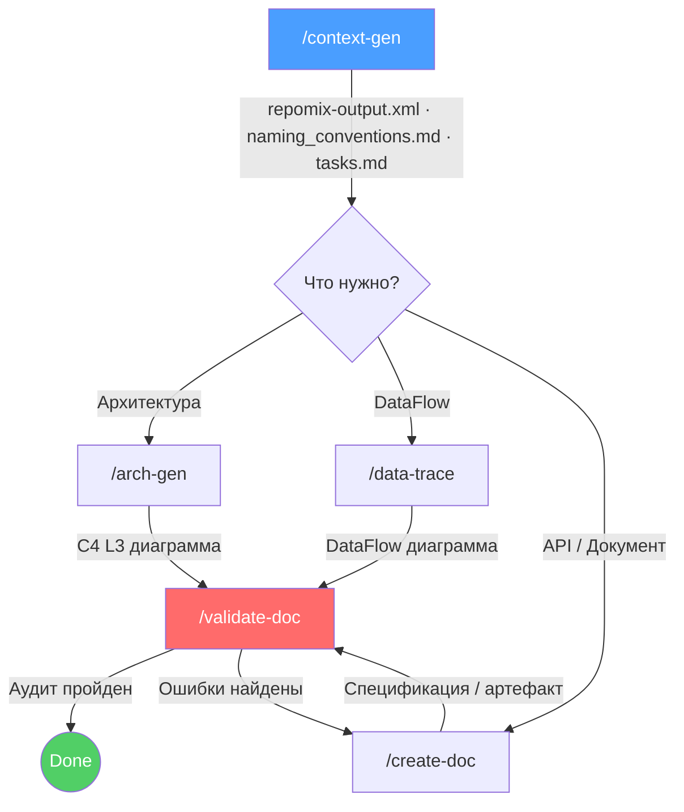
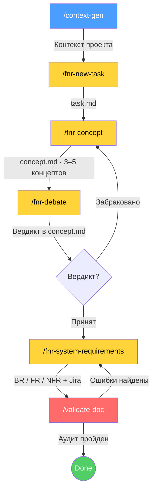

<p align="center">
  <strong>System Analyst Helper</strong><br>
  <em>Промышленный фреймворк для&nbsp;ИИ‑агентов: реверс‑инжиниринг, документация, системные требования</em>
</p>

<p align="center">
  
  
  
  
</p>

---

> **Реверс‑инжиниринг** — превращайте код в C4‑диаграммы, DataFlow и API‑спецификации.<br>
> **Системные требования** — проходите путь от проблемы до формального BR/FR/NFR с Jira‑декомпозицией.
>
> Ключевой принцип — **нулевой допуск к галлюцинациям**: каждый факт прослеживается до строки кода (Traceability).

---

## Содержание

- [Быстрый старт (Установка)](#-быстрый-старт-установка)
- [Обновление](#-обновление)
- [Процессы и диаграммы](#-процессы-и-диаграммы)
- [Доступные команды](#-доступные-команды)
- [Стандарт Doc-Architect v3.0](#-стандарт-doc-architect-v30)
- [Структура системы](#-структура-системы)
- [Применение на практике](#применение-на-практике)
- [Граф проекта (Neo4j)](#-граф-проекта-neo4j)

---

## ⚡ Быстрый старт (Установка)

Разверните SA-Helper в проекте одной командой:

<!-- prettier-ignore -->
| Платформа | Команда |
|-----------|---------|
| **macOS / Linux** | `curl -sSL https://raw.githubusercontent.com/boboden541/sa-helper/main/install.sh \| bash` |
| **Windows (Обязательное через терминал Git Bash)** | `curl -sSL https://raw.githubusercontent.com/boboden541/sa-helper/main/install.sh -o /tmp/sa-install.sh && bash /tmp/sa-install.sh && rm /tmp/sa-install.sh` |

> **Обновление после правок эталонов и ресурсов.** Команды и навыки работают с **установленной** копией в вашем проекте. Если изменились эталоны (`examples/`) или ресурсы навыков (`resources/`) — запустите установку повторно, иначе установленная копия останется на прежней версии и команды продолжат работать по старым правилам.

### Что произойдёт

Скрипт спросит, какой IDE‑агент вы используете:

| | 1. Claude Code | 2. Antigravity | 3. Codex | 4. OpenCode | 5. Cline | 6. DevX (МТС) | 7. Universal |
|:---|:---|:---|:---|:---|:---|:---|:---|
| **Корень** | `.claude/` | `.agent/` | `.agents/` | `.opencode/` | `.cline/` | `.clinerules/` | `.agents/` |
| **Команды** | `commands/` | `workflows/` | `prompts/` | `commands/` | `workflows/` | `workflows/` | `commands/` |
| **Навыки** | `skills/` | `skills/` | `skills/` | `skills/` | `skills/` | `skills/` | `skills/` |

> Существующие файлы не удаляются — обновляются только управляемые подпапки.

---

### 🔧 Продвинутая настройка (Алиас `init_sa`)

#### macOS / Linux

1. Определите шелл: `echo $SHELL`
   - `/bin/zsh` → `~/.zshrc`
   - `/bin/bash` → `~/.bashrc`
2. Запишите алиас:

```bash
echo "alias init_sa='curl -sSL https://raw.githubusercontent.com/boboden541/sa-helper/main/install.sh -o /tmp/sa-install.sh && bash /tmp/sa-install.sh && rm /tmp/sa-install.sh'" >> ~/.zshrc
```

1. Примените: `source ~/.zshrc`
2. Проверьте: введите `init_sa` в любой папке проекта.

<details>
<summary>Обновление старого алиаса</summary>

```bash
# zsh
sed -i '' '/alias init_sa/d' ~/.zshrc
echo "alias init_sa='curl -sSL https://raw.githubusercontent.com/boboden541/sa-helper/main/install.sh -o /tmp/sa-install.sh && bash /tmp/sa-install.sh && rm /tmp/sa-install.sh'" >> ~/.zshrc

# bash — замените sed -i '' на sed -i
sed -i '/alias init_sa/d' ~/.bashrc
echo "alias init_sa='curl -sSL https://raw.githubusercontent.com/boboden541/sa-helper/main/install.sh -o /tmp/sa-install.sh && bash /tmp/sa-install.sh && rm /tmp/sa-install.sh'" >> ~/.bashrc
```

</details>

#### Windows

> Требуется Git Bash (ставится вместе с Git for Windows).

Откройте профиль PowerShell:

```powershell
notepad $PROFILE
```

Добавьте функцию:

```powershell
function init_sa {
    git clone --depth 1 https://github.com/boboden541/sa-helper.git $env:TEMP\sa-helper
    bash $env:TEMP\sa-helper\install.sh
    Remove-Item -Recurse -Force $env:TEMP\sa-helper
}
```

> **После установки перезагрузите IDE** (Reload Window), чтобы команды появились в чате.

---

## 🔄 Обновление

Запустите команду установки повторно — скрипт обновит только управляемые файлы.

| Платформа | Действие |
|-----------|----------|
| **macOS / Linux** | `init_sa` или curl‑команда из быстрого старта |
| **Windows** | `init_sa` или git‑clone‑команда из быстрого старта |

---

## 📊 Процессы и диаграммы

### Процесс 1: Реверс‑инжиниринг и документация



### Процесс 2: Системные требования (FNR Pipeline)



---

## 🛠 Доступные команды

### Реверс‑инжиниринг

| Команда | Описание | Результат |
|:--------|:---------|:----------|
| `/context-gen` | Подготовка контекста проекта | `repomix-output.xml`, `naming_conventions.md`, `tasks.md` |
| `/arch-gen` | Формирование архитектуры | C4 Level 3 диаграмма (PlantUML) |
| `/data-trace` | Формирование DataFlow | Диаграмма по сущности или атрибуту |
| `/create-doc` | Генерация документа | Спецификация API / метода / артефакта |
| `/open-api` | Генерация OpenAPI-спеки | `sa_documentation/openapi/<path>.yaml` (Swagger, OpenAPI 3.0.3) |
| `/validate-doc` | Тотальная проверка | Аудит на соответствие коду и стандартам |
| `/prd-grooming` | Груминг PRD (понятность / валидность / реализуемость / противоречия) | `sa_documentation/prd/{file_name}.md` |
| `/bft-build` | Построение БФТ по входящему контексту (PRD / текст / отчёт груминга) с учётом ограничений системы | `sa_documentation/bft/{bft_name}.md` |

### Системные требования (FNR Pipeline)

| Команда | Роль | Описание | Результат |
|:--------|:-----|:---------|:----------|
| `/fnr-new-task` | Problem Analyst | Анализ проблемы, поиск корня в коде | `FNR/FNR_N/task.md` |
| `/fnr-concept` | Solution Designer | Спектр решений: от чистой архитектуры до костыля | `FNR/FNR_N/concept.md` |
| `/fnr-debate` | Architectural Debate | Архитектор vs Адвокат Дьявола — 3 раунда | Вердикт дописан в `concept.md` |
| `/fnr-system-requirements` | System Requirements Analyst | BR / FR / NFR + Jira‑декомпозиция; описание каждой доработки двухуровневое: «Общее описание доработки» (обзорный уровень) + «Описание доработок» (системно‑аналитический уровень) | `FNR/FNR_N/system_requirements.md` |

---

## 🧠 Стандарт Doc-Architect v3.0

Все генерируемые документы следуют четырём правилам:

| # | Правило | Суть |
|:--|:--------|:-----|
| 1 | **Origin Lineage** | Каждое поле таблицы имеет источник: `DB: Table.Column` / `API: Service.Method` / `Computed [Layer]: Logic` |
| 2 | **Technical Endpoints** | Вместо SEO‑алиасов — технические контракты: `METHOD /controller/action/{id}` |
| 3 | **UML Diagrams** | Обязательные Sequence и Activity диаграммы в PlantUML |
| 4 | **Deep Inspection** | Анализ не только контроллера, но и сервисов, DAO, внешних интеграций |

---

## 📂 Структура системы

<details>
<summary><strong>Claude Code</strong> — <code>.claude/</code></summary>

```
.claude/
├── commands/    ← команды (/context-gen, /fnr-new-task и др.)
└── skills/      ← навыки (роли агента)
```

</details>

<details>
<summary><strong>Antigravity</strong> — <code>.agent/</code></summary>

```
.agent/
├── workflows/   ← команды
└── skills/      ← навыки
```

</details>

<details>
<summary><strong>Codex</strong> — <code>.agents/</code></summary>

```
.agents/
├── prompts/     ← команды через /prompts:...
└── skills/      ← навыки (repo-level)
```

</details>

<details>
<summary><strong>OpenCode</strong> — <code>.opencode/</code></summary>

```
.opencode/
├── commands/    ← команды
└── skills/      ← навыки
```

</details>

<details>
<summary><strong>Universal</strong> — <code>.agents/</code></summary>

```
.agents/
├── commands/    ← команды
└── skills/      ← навыки
```

</details>

### Навыки

Каждый навык содержит **SKILL.md** (ролевая модель), **resources/** (чек‑листы, стандарты), **examples/** (шаблоны).

| Навык | Назначение |
|:------|:-----------|
| `architecture/` | Реверс‑инжиниринг архитектуры |
| `db_archeologist/` | Анализ базы данных |
| `technical-documentation/` | Генерация документации |
| `problem-analyst/` | Диагностика проблем, постановка задачи |
| `solution-designer/` | Генерация спектра решений |
| `architectural-debate/` | Дебаты: Архитектор vs Адвокат Дьявола |
| `system-analyst-sysreq/` | Формирование системных требований |
| `prd-groomer/` | Груминг PRD: диагностика требований и отчёт о находках |
| `bft-builder/` | Построение БФТ: генерация бизнес-функциональных требований из входящего контекста |

---

# Применение на практике

### Я хочу описать архитектуру проекта

```text
1.  /context-gen Я, как системный аналитик, должен провести revese-engineering текущего проекта. Мне нужно полностью задокументировать проект:
- Составить C4-диаграмму (до уровня C3), описать основные компоненты сервиса, описать базу данных, 
- Описать имеющиеся API-интерфейсы, которые предоставляет сервис, (один API = одна задача = один документ)
- Описать интеграционные взаимодействия данного сервиса с другими сервисами (одна интеграция = одна задача = один документ). 
- Описать способы взаимодействия данного проекта с базой данных (если есть)

2. На выходе ты получишь файл tasks.md
3. Найди там задачу на описание архитектуры
4. Переходим к генерации:
  4.1 /create-doc {весь текст задачи} -> Markdown-файл с текстовым описанием архитектуры
  4.1 /arch-gen {Весь текст этой же задачи} -> С4-диаграмма в нотации UML
```

### Я хочу описать API

```text
1.  /context-gen Я, как системный аналитик, должен провести revese-engineering текущего проекта. Мне нужно полностью задокументировать проект:
- Составить C4-диаграмму (до уровня C3), описать основные компоненты сервиса, описать базу данных, 
- Описать имеющиеся API-интерфейсы, которые предоставляет сервис, (один API = одна задача = один документ)
- Описать интеграционные взаимодействия данного сервиса с другими сервисами (одна интеграция = одна задача = один документ). 
- Описать способы взаимодействия данного проекта с базой данных (если есть)

2. На выходе ты получишь файл tasks.md
3. Найди в этом файле задачи на описание экранов и API-методов
4. Убедись, что одна задача на описание API содержит в ожидаемом результате один файл описания (один API = один документ). Если это не так:
- Попроси ИИ исправить
- Свяжись с автором sa-helper, буду лечить

5. /create-doc {весь текст задчи}

3.  /validate-doc  {указать путь к новому файлу}
```

### Составить DataFlow объекта

```text
1.  /context-gen  Я, как системный аналитик, должен провести revese-engineering текущего проекта. Мне нужно полностью задокументировать проект:
- Составить C4-диаграмму (до уровня C3), описать основные компоненты сервиса, описать базу данных, 
- Описать имеющиеся API-интерфейсы, которые предоставляет сервис, (один API = одна задача = один документ)
- Описать интеграционные взаимодействия данного сервиса с другими сервисами (одна интеграция = одна задача = один документ). 
- Описать способы взаимодействия данного проекта с базой данных (если есть)

2. На выходе ты получишь файл naming_conventions.md (словарь код ↔ бизнес)

3. Изучи naming_conventions.md и выбери сущность, которую хочешь изучить или отдельный атрибут сущности

4.  /data-trace  {название сущности/объекта или атрибута}
```

### Пройти путь от проблемы до системных требований

```text
1. /context-gen  Я, как системный аналитик, должен провести дорабрику текущего проекта. Мне нужен глубокий анализ проекта, доработки могут затронуть любой слой и абстракцию текущего проекта.

2. /fnr-new-task  После cron‑импорта данные, созданные вручную в web_db, пропадают. Нужно понять причину и описать проблему. -> sa_documentation/FNR/FNR_1/task.md

3. /fnr-concept  sa_documentation/FNR/FNR_1/task.md -> concept.md — 3–5 концептов (от чистой архитектуры до костыля)

4. /fnr-debate  sa_documentation/FNR/FNR_1/concept.md -> Вердикт дебатов дописан в concept.md (3 раунда, аргументы подтверждены кодом)

5. /fnr-system-requirements  sa_documentation/FNR/FNR_1/concept.md -> BR/FR/NFR + Jira‑декомпозиция + PlantUML (As‑Is / To‑Be / Migration).
   Описание каждой доработки двухуровневое: «Общее описание доработки» (обзорный уровень) + «Описание доработок» (системно‑аналитический уровень)

6. /validate-doc  sa_documentation/FNR/FNR_1/system_requirements.md
```

---

# Дополнительный раздел

## 🌳 Граф проекта (Neo4j)

SA-Helper строит **граф кодовой базы** в Neo4j — карту всех классов, функций, вызовов, SQL‑запросов и DB‑объектов. Агент получает точную структуру проекта вместо угадывания по тексту файлов.

**Что даёт:**

- **Цепочки вызовов** — кто кого вызывает, на какую таблицу ссылается
- **Impact‑анализ** — что сломается при изменении функции или таблицы
- **DB‑анализ** — lineage таблиц, хранимых процедур, view; поиск orphan‑объектов
- **Архитектурный обзор** — контроллеры → сервисы → DAO → таблицы

### Настройка

> **Предварительные требования:** Docker Desktop, Python 3.9+.

#### Шаг 1: Установите SA-Helper в проект

Если ещё не установили — выполните команду из [быстрого старта](#-быстрый-старт-установка). В корне проекта появятся `indexer/` и `docker-compose.yml`.

**Временный скрипт установки для graph-tree ветки:**

<details>
<summary><strong>macOS / Linux</strong></summary>

```bash
git clone --branch graph-tree --depth 1 https://github.com/boboden541/sa-helper.git /tmp/sa-gt && \
cp -R /tmp/sa-gt/indexer . && \
mkdir -p .claude/commands .claude/skills && \
cp -R /tmp/sa-gt/.claude/commands/. .claude/commands/ && \
cp -R /tmp/sa-gt/.claude/skills/. .claude/skills/ && \
rm -rf /tmp/sa-gt
```

</details>

<details>
<summary><strong>Windows (PowerShell)</strong></summary>

```powershell
git clone --branch graph-tree --depth 1 https://github.com/boboden541/sa-helper.git $env:TEMP\sa-gt
Copy-Item -Recurse $env:TEMP\sa-gt\indexer .
New-Item -ItemType Directory -Force -Path .claude\commands, .claude\skills
Copy-Item -Recurse $env:TEMP\sa-gt\.claude\commands\* .claude\commands\
Copy-Item -Recurse $env:TEMP\sa-gt\.claude\skills\* .claude\skills\
Remove-Item -Recurse -Force $env:TEMP\sa-gt
```

</details>

#### Шаг 2: Создайте окружение и установите зависимости

<details>
<summary><strong>macOS / Linux</strong></summary>

```bash
python3 -m venv .venv && .venv/bin/pip install -r indexer/requirements.txt
```

</details>

<details>
<summary><strong>Windows (PowerShell)</strong></summary>

```powershell
python -m venv .venv
.venv\Scripts\pip install -r indexer\requirements.txt
```

</details>

#### Шаг 3: Запустите базу и проиндексируйте проект

```bash
# Запустите Neo4j
docker compose -f indexer/docker-compose.yml up -d
```

```bash
# Проверить, что база работает
curl -s http://localhost:7474 > /dev/null && echo "OK — Neo4j работает" || echo "WAIT — подождите ещё немного"
```

**Индексация проекта:**

<details>
<summary><strong>macOS / Linux</strong></summary>

```bash
.venv/bin/python indexer/main.py .
```

</details>

<details>
<summary><strong>Windows (PowerShell)</strong></summary>

```powershell
.venv\Scripts\python indexer\main.py .
```

</details>

**Для проектов с DDL‑репозиториями (SQL Server, PostgreSQL):**

<details>
<summary><strong>macOS / Linux</strong></summary>

```bash
.venv/bin/python indexer/main.py . --db-schema /path/to/db_repo --default-schema dbo
```

</details>

<details>
<summary><strong>Windows (PowerShell)</strong></summary>

```powershell
.venv\Scripts\python indexer\main.py . --db-schema C:\path\to\db_repo --default-schema dbo
```

</details>

| Флаг | Описание |
|:-----|:---------|
| `--db-schema` | Путь к папке с `.sql` файлами (можно указать несколько раз) |
| `--default-schema` | Схема по умолчанию: `dbo` (MS SQL), `public` (PostgreSQL). Если не указан — определяется автоматически из DDL |

#### Шаг 4: Подключите MCP‑сервер

MCP — основной способ работы с графом. Без него агент не сможет использовать графовые данные.

<details>
<summary><strong>macOS / Linux</strong></summary>

```bash
claude mcp add sa-helper-graph -- $(pwd)/.venv/bin/python indexer/server/mcp_server.py
```

</details>

<details>
<summary><strong>Windows (PowerShell)</strong></summary>

```powershell
claude mcp add sa-helper-graph -- "$PWD\.venv\Scripts\python" indexer\server\mcp_server.py
```

</details>

После регистрации агент автоматически получит доступ к **13 графовым инструментам**:

| Инструмент | Что делает |
|:-----------|:-----------|
| `graph_schema` | Обзор структуры: классы, функции, таблицы, эндпоинты |
| `graph_call_chain` | Цепочка вызовов от функции (на N уровней вглубь) |
| `graph_impact` | Кто зависит от сущности (класс, функция, таблица) |
| `graph_arch_summary` | Архитектурный обзор: контроллеры → сервисы → DAO → таблицы |
| `graph_select_files` | Выбор файлов по описанию задачи |
| `graph_export` | Экспорт подграфа (`text` / `json` / `mermaid`) |
| `graph_query` | Произвольный read‑only Cypher запрос |
| `graph_stats` | Статистика: количество узлов и связей по типам |
| `graph_db_schema` | Все DB‑объекты: таблицы, view, хранимые процедуры, функции |
| `graph_db_lineage` | Lineage DB‑объекта: зависимости вверх и вниз |
| `graph_db_orphans` | DB‑объекты без связей к коду |
| `graph_db_unresolved` | Ссылки в коде без DDL‑определений |
| `graph_db_impact` | Транзитивный impact при изменении DB‑объекта |

### Как команды используют граф

Все команды SA-Helper автоматически используют граф, когда MCP подключён:

| Команда | Что получает из графа |
|:--------|:----------------------|
| `/context-gen` | Автофильтрация файлов через `select-files` → repomix упаковывает только нужные |
| `/arch-gen` | Структура классов, эндпоинтов, внешних сервисов |
| `/data-trace` | Точные цепочки вызовов вместо grep‑анализа |
| `/create-doc` | Подграф вокруг сущности — точки входа, связи, зависимости |
| `/validate-doc` | Сверка утверждений с рёбрами графа (`CALLS`, `QUERIES`, `EXTENDS`) |
| `/fnr-*` | Структура проекта и зависимости для диагностики проблем |

> **Fallback:** если Neo4j не запущен — команды работают через `repomix-output.xml` как раньше.

### Поддерживаемые языки

| Язык | Расширения | Что извлекается |
|:-----|:-----------|:----------------|
| Python | `.py` | Классы, функции, импорты, вызовы, SQL‑таблицы, Flask/FastAPI эндпоинты, requests/httpx |
| PHP | `.php` | Классы, трейты, функции, вызовы, SQL, EXEC/CALL SP, CActiveRecord, Yii‑эндпоинты |
| Java | `.java` | Классы, интерфейсы, методы, вызовы, SQL + JPA `@Table`, Spring, RestTemplate |
| JS / TS | `.js` `.jsx` `.ts` `.tsx` | Классы, функции, import/export, вызовы, SQL, Express, fetch/axios |
| Go | `.go` | Struct, Interface, функции, вызовы, SQL, net/http/Gin эндпоинты |
| SQL DDL | `.sql` | CREATE TABLE, VIEW, PROCEDURE, FUNCTION, зависимости |

### Дополнительные возможности

<details>
<summary><strong>Инкрементальное обновление</strong> (только git‑репозитории)</summary>

Перестраивает только изменённые файлы. Fallback на полную пересборку при >30% изменений.

**macOS / Linux:**

```bash
.venv/bin/python indexer/main.py . --incremental
```

**Windows (PowerShell):**

```powershell
.venv\Scripts\python indexer\main.py . --incremental
```

</details>

<details>
<summary><strong>CLI‑запросы</strong> (альтернатива MCP для не‑Claude агентов)</summary>

**macOS / Linux:**

```bash
.venv/bin/python indexer/server/query.py schema                    # структура проекта
.venv/bin/python indexer/server/query.py call-chain "createAction" # цепочка вызовов
.venv/bin/python indexer/server/query.py impact "orders" --type table  # impact‑анализ
.venv/bin/python indexer/server/query.py db-lineage "show"         # lineage DB‑объекта
.venv/bin/python indexer/server/query.py --help                    # все команды
```

**Windows (PowerShell):**

```powershell
.venv\Scripts\python indexer\server\query.py schema                     # структура проекта
.venv\Scripts\python indexer\server\query.py call-chain "createAction"  # цепочка вызовов
.venv\Scripts\python indexer\server\query.py impact "orders" --type table # impact‑анализ
.venv\Scripts\python indexer\server\query.py db-lineage "show"          # lineage DB‑объекта
.venv\Scripts\python indexer\server\query.py --help                     # все команды
```

> Старые пути (`python indexer/query.py`, `python indexer/mcp_server.py`) тоже работают через stub‑файлы.

</details>

**Визуализация в браузере:** [http://localhost:7474](http://localhost:7474) — логин: `neo4j` / `sahelper2026`.

---
